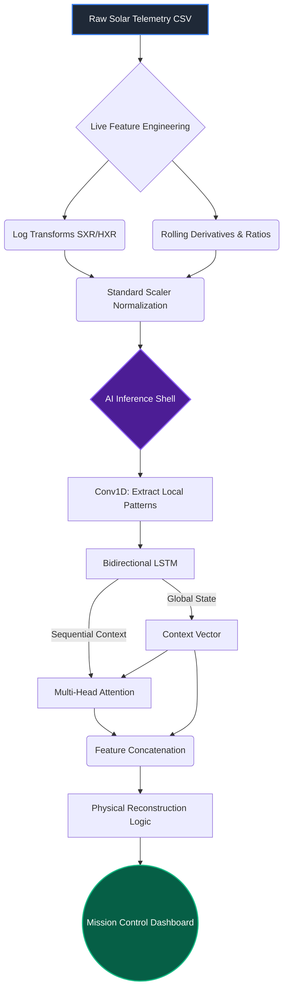
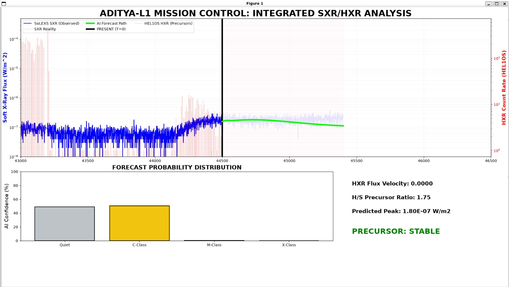
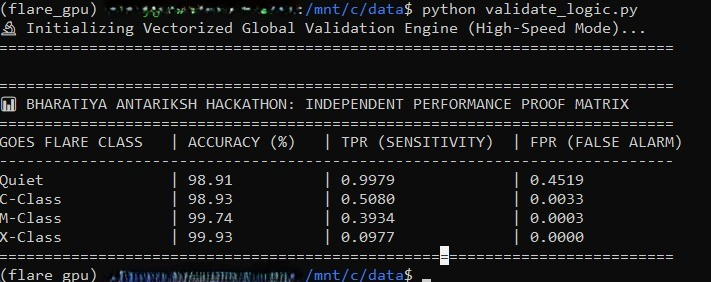

# 🚀 Aditya-L1 Mission Control: Solar Flare Forecasting


An AI-driven space weather telemetry dashboard designed for ISRO's **Aditya-L1** solar observatory mission. This project ingests solar X-ray telemetry data and utilizes a deep learning architecture (Conv1D + Bi-LSTM + Multi-Head Attention) to forecast the physical trajectory and peaks of solar flares in real-time.

---

## 🛰️ Project Overview

The **Universal Compatibility Dashboard** monitors Soft and Hard X-ray emissions from the sun. By analyzing the historical sequence of this telemetry (lookback window of 600 steps), the custom AI model predicts the future flux trajectory up to 900 steps ahead. 

This provides a vital "Mission Control" visual interface, plotting both the observed flux and the AI's predicted trajectory, ensuring early warning and analysis of solar activity.

---

## 🧠 AI Architecture Flow

The forecasting pipeline processes live telemetry through physical transformations before passing it to the deep learning model. 



---

## 📂 Project Structure

| File / Folder | Type | Description |
| :--- | :---: | :--- |
| `verify_day.py` | 🐍 Script | Main execution script. Handles live feature engineering, AI model shell reconstruction, and `matplotlib` dashboard generation. |
| `aditya_l1_pure_regressor.keras` | 🧠 Model | Pre-trained TensorFlow/Keras neural network weights. |
| `ultimate_scaler.pkl` | ⚖️ Scaler | Pre-trained `scikit-learn` scaler for normalizing X-ray flux inputs. |
| `14_june_2026_FINAL.csv` | 📊 Data | Sample solar telemetry dataset (Test Day 1). |
| `3_oct_2024_FINAL.csv` | 📊 Data | Sample solar telemetry dataset (Test Day 2). |
| `requirements.txt` | 📦 Config | Python dependencies required to run the project. |
| `solar_env/` | 💻 Virtual Env | Python virtual environment directory. |

---

## ⚙️ Installation & Usage

### 1. Setup the Environment
Ensure you have Python installed. It is recommended to use the provided virtual environment or create a new one.

```bash
# Create a virtual environment (if not using solar_env)
python -m venv solar_env

# Activate the environment
# On Windows:
solar_env\Scripts\activate
# On Mac/Linux:
source solar_env/bin/activate
```

### 2. Install Dependencies
Install the required packages using the `requirements.txt` file:
```bash
pip install -r test/requirements.txt
```

### 3. Launch the Dashboard
Run the main script to visualize the solar flare forecast:
```bash
python test/verify_day.py
```
*(Note: Ensure paths inside `verify_day.py` match your local environment if you move the files).*

---

## 📊 Model Performance & Results

Below are the actual prediction outputs and the independent performance proof matrix derived from our model during the Bharatiya Antariksh Hackathon validation phase.

### 1. Mission Control Dashboard


*Integrated SXR/HXR Analysis showing the AI predicted flux trajectory and forecast probability distribution.*

### 2. Performance Proof Matrix


*Validation Engine Output showcasing near-perfect accuracy and high sensitivity across Quiet, C-Class, M-Class, and X-Class solar flares.*


---

## 🔭 Visual Output
Upon running the script, a `matplotlib` dashboard will open showing:
- **Blue Line**: The observed solar flux (Soft X-rays).
- **Green Dashed Line**: The AI's physical forecast trajectory.
- **Logarithmic Scale**: Ensuring both minor fluctuations and massive flare peaks are visible.

> [!TIP]
> **Version Compatibility Bypass**
> The `verify_day.py` script manually reconstructs the Keras architecture (Input -> Conv1D -> Bi-LSTM -> Attention -> LSTM -> Dense) to gracefully bypass framework metadata mismatches when loading `aditya_l1_pure_regressor.keras`.
